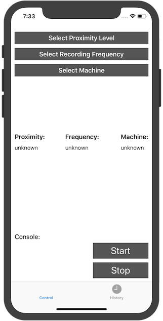
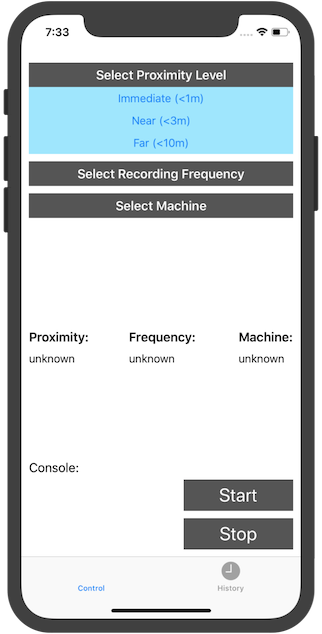
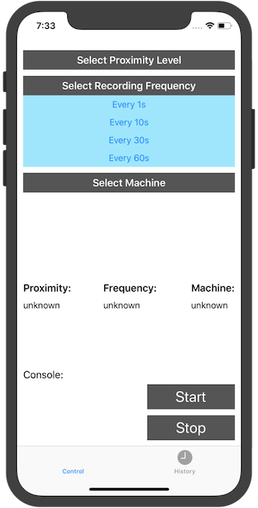
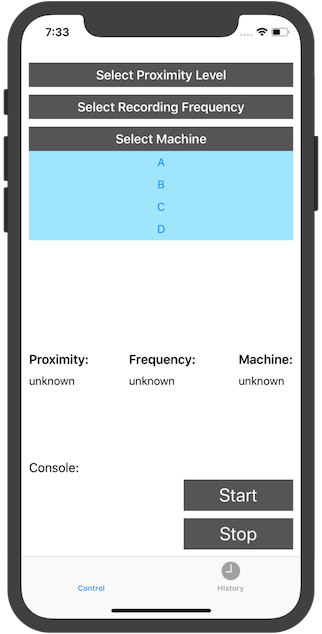
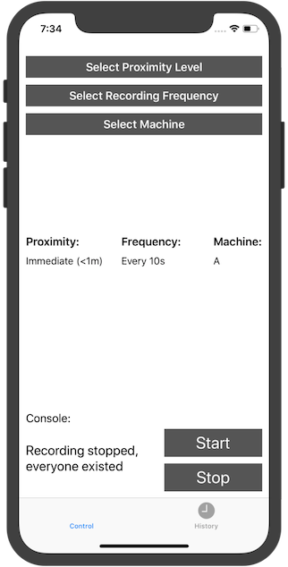
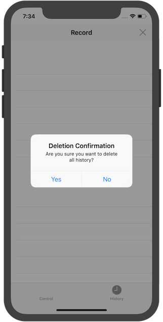

# iBeacon  Location Based App

## About
This is an ios app that works as a data collection sensor leveraging beacon technology. I built this for Halliburton under the guidance of Amir Bar as a side project. Specifically, this app runs on the iOS devices attached to equipments on Halliburton's working field. It aims to detect and report entrance and exits of employees wearing beacon to provide customized training/safety guidelines. It is also wired up with Halliburton's backend  database using Experience API (xAPI).

## Getting Started

### Installing
```
git clone https://github.com/EdwardFeng523/IBeaconProject.git
cd IBeaconProject
```

### Running locally

Under the project directory, make sure you have the latest version of XCode installed, and double click iBeaconProj.xcodeproj to open this up in XCode. You can either run it through connecting your phone to your computer or run it on a simulator provided by XCode.

## Demo

```
Open up the app see main control panel.
```

```
You can set the proximity level to adjust the sensitivity of the detection.
```

```
Can also change the recording frequency.
```


```
Specify the machine/equipment that the device is attached to.
```

```
Start recording.
```

```
Stop recording.
```

```
Can view and delete logs.
```

